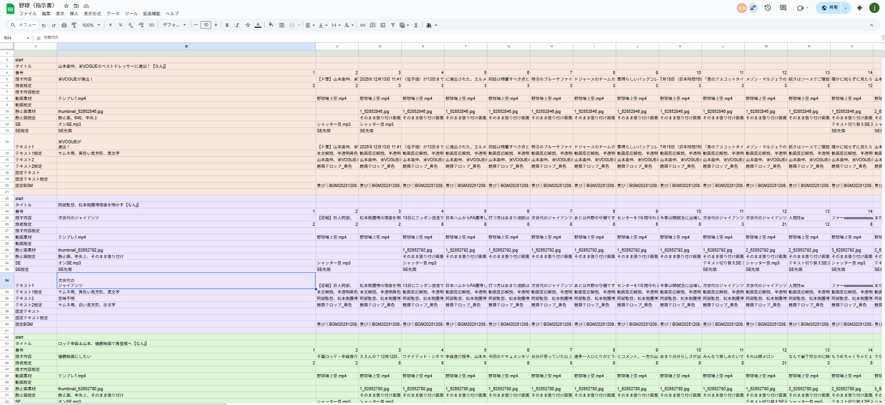

# NewsPipe – ニュース動画自動生成システム

NewsPipe は、  
まとめサイト・ニュース記事を自動で収集・加工、AI によるタイトル生成・感情分析・テロップ生成を行い、  
YouTube 動画制作向けの動画指示書（スプレッドシート形式）を完全自動で生成するシステムです。
取得する記事数にもよりますが1日に30本ほど動画をあげることも可能です。

ポートフォリオとして公開できるよう、1度完成していたシステムを構成のわかりやすさ・再利用性・関数の責務分離を重視して再設計しています。


## **注意**
- NewsPipeは指示書の自動生成・出力までを行うシステムであり、実際の動画生成・合成音声の生成・アップロードは共同開発者が手掛ける別システムで行います。
- 本プロジェクトでは、共同開発者の理解コストを最小化するため、オブジェクト指向ではなく 関数ベースの構成を採用しています。


## **主な機能**

### **まとめサイトの自動スクレイピング**
- スレッドタイトル
- 投稿本文
- 添付画像URL
などを取得し、内部フォーマットに整形。

### ✔ **Gemini API を使った AI 自動判定**
- 動画タイトル生成  
- サムネ用テキスト生成  
- 記事で語られている人物の抽出  
- ジャンルフィルタリング（野球系のみ抽出）  

### ✔ **HuggingFace 日本語感情モデルによる BGM 自動選択**
- 長文を 先頭400文字 + 末尾400文字 に切り出して解析  
- 感情（喜び／怒り／悲しみ etc.）に応じて BGM指定

### **✔ サムネイル画像の自動収集・生成**
- 記事本文から 関連人物の抽出
- OpenCV による顔検出
- 面積比で「見栄えの良い画像」優先選択  
- 以下の複数パターンを自動生成  
  - 1枚サムネ（正方形）
  - 横長サムネ（11:8 比率）
  - 2枚組サムネ（コラージュ） 
- テキストは Gemini が生成し、ランダムで複数案を作成
※実際の YouTube 用サムネイル運用を意識した設計。

### ✔ **スプレッドシート に動画指示書を自動生成**
- テキスト整形（split rules）
- SE（効果音）挿入ルール
- 合成音声の話者のランダム化
- 字幕のランダム色付け
- 作成した指示書をもとに自然な動画が生成されます。


### **主な使用技術**

- Python 3.10
- Gemini API (構造化レスポンス、スキーマ活用)
- HuggingFace Transformers（日本語感情分析モデルを使用）
- BeautifulSoup4
- selenium
- gspread / Google Sheets API
- Google Drive API（認証・画像アップロード）
- YAML 設定ファイル管理


## **指示書のサンプル**




## **実際のチャンネル**

https://www.youtube.com/@%E3%83%97%E3%83%AD%E9%87%8E%E7%90%83%E3%81%BE%E3%81%A8%E3%82%81%E3%82%B9%E3%82%BF%E3%82%B8%E3%82%A2%E3%83%A0


## **制作にあたっての学習したこと、努力した点**

### 1. モジュール分割・責務分離・関数設計を意識した開発手法
- Type Hint（型ヒント）による可読性向上
- 設定値を settings.py、YAMLに切り離すことで、“ハードコーディングしない設計” を学習
- →今後10チャンネル、20チャンネルと増やすにあたって拡張が非常に容易になった。
- 再利用可能なユーティリティの分割と管理

### 2. 外部 API の実務的な扱い
- Google Gemini API（スキーマ定義で構造化レスポンスを取得）
- Google Drive API（認証・アップロード）
- Google Sheets API（動画編集用データの自動生成）


### 3. AI（LLM）の出力を形式化
- LLM の出力をそのまま使用すると、出力結果の型や形式がぶれるためスキーマ制約で整形

### 4. メディア処理・文章整形のロジック構築
- 改行 → 句読点 → セクション分割の新ルール設計
- サムネイルの複数パターンランダム出力
- テキスト感情分析による BGM 自動選択
- など実際の動画投稿や反応を踏まえながら必要な機能を考え、適宜追加していく力と変更に耐えられる設計

### 5. 共同開発
- 実際の動画制作の部分は共同開発者が書いているため、指示書の厳密なルール化
- 後々の互いのコードを共有する想定のため、仮想環境を作成しライブラリなどの環境の明確化と共有容易性に配慮
- 足並みをそろえた開発をするために機能ごとに開発のスケジュールを決め、毎日平日2時間休日8時間zoomを繋ぎながら、1か月ほど開発に時間をかけた


## **今後学習したい点、追加していきたい機能**

### テストコード
- 現状は手動テストが中心
- 複数チャンネルに対応できるように自動テストを追加していきたい

### LLM のプロンプトエンジニアリングを体系化したい
- 現状は成功した prompt を採用しているが、“なぜ成功したか” の言語化や改善ループを深めたい

### 例外処理やログの体系化
- 現行のシステムでは実装されているが、こちらのシステムへの移行作業を進めていく予定


## インストールとセットアップ
1. クローン
git clone https://github.com/junjungaoon-with/newspipe.git
cd newspipe

2. 依存関係のインストール
pip install -r requirements.txt

3. 各種ID、APIkeyの設定
drive_id、spreadsheet_id、gemini_api_keyを設定

▶ 使い方
python -m src.main


設定は config/settings.py , config/channels/baseball.ymlで調整可能。


## プロジェクト構成図
```
project-root/
├── src/   
│   ├──common/             # 共通ロジック（LLM / scraping / thumbnail / media など）      
│   │   ├── gemini/
│   │   ├── gemini/
│   │   ├── scraping/
│   │   ├── pipeline/
│   │   ├── media/
│   │   ├── thumbnail/
│   │   └── utils/
│   ├── channels/          # チャンネル別ロジック
│   └── main.py            # 起動用ファイル
├── config/
│   ├── channels/          # チャンネル設定（YAML）
│   └── settings.yaml
├── data/                  # スクレイピング結果・画像など
├── requirements.txt
├── README.md
└── LICENSE
```


## ライセンス
このリポジトリは MIT License のもとで公開されています。
商用利用・改変・再配布が自由です。

---